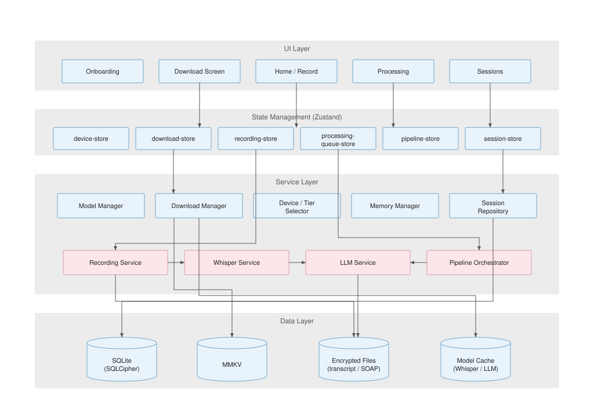

<h1 align="center">CaseScriptAI</h1>
<p align="center">
  <strong>
    Privacy-first, on-device medical transcription and clinical note generation
  </strong>
</p>
<p align="center">
  
  
  
  
</p>

CaseScriptAI records clinical encounters on **iOS and Android**, transcribes with on-device Whisper, and drafts SOAP notes with a local quantized LLM (ExecuTorch). After the initial model download, inference runs offline — PHI is not sent to cloud AI APIs.

Architecture and MVP status: [`docs/ARCHITECTURE.md`](docs/ARCHITECTURE.md), [`docs/SLICES_PLAN.md`](docs/SLICES_PLAN.md).

## Architecture



## Why on-device

- **Privacy:** Transcription and note generation stay on the clinician’s device; no cloud inference path in the product design.
- **Offline use:** After models are downloaded, core capture → process → note flow does not require the network.
- **Lower inference cost:** Compute runs on-device instead of per-minute cloud STT/LLM APIs.
- **Fit for constrained environments:** Useful where connectivity is unreliable (remote clinics, RF-restricted areas).

## Getting started

From the **repository root**:

```bash
yarn install
```

Native modules (ExecuTorch, and currently FFmpeg kit wiring) need a **dev client**, not Expo Go:

```bash
yarn workspace casescriptai ios       # requires Xcode
yarn workspace casescriptai android   # requires Android Studio
yarn workspace casescriptai web       # UI layout only — no AI/native modules
yarn workspace casescriptai lint
yarn workspace casescriptai test
```

Dev practices for agents and contributors: [`AGENTS.md`](AGENTS.md), [`PROJECT_RULES.md`](PROJECT_RULES.md).
