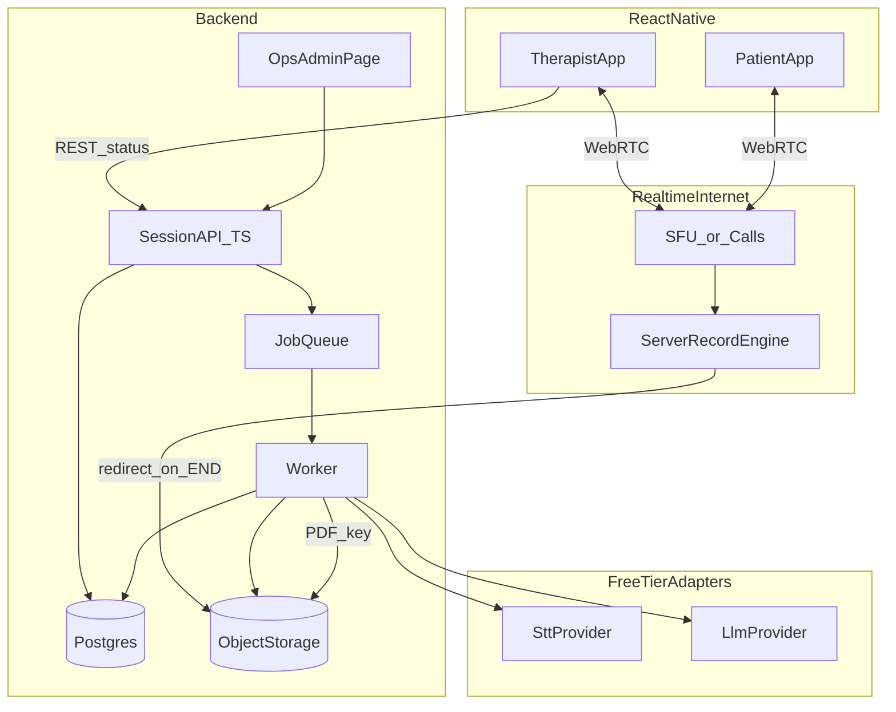

# CaseScriptAI — Cloud MVP Architecture

> **Cloud-backed** live therapist↔patient sessions for **iOS + Android** (web later).
> Audio is recorded **server-side**, stored, transcribed (STT API), structured (LLM API), and returned as PDF.
> Free-tier providers for MVP; India residency / compliance hardening later via **config/provider swap** (not a rewrite).
>
> **Start every new cloud chat/tab here.** Do not merge other docs into this file — follow the links below.
> On-device offline product (historical / `mvp_local_AI`): [`ARCHITECTURE.md`](./ARCHITECTURE.md) + [`SLICES_PLAN.md`](./SLICES_PLAN.md) — do not overwrite those for cloud work.

---

## 0. Document hierarchy (read in order)

| Order | Document | Use for |
|-------|----------|---------|
| 1 | **This file** (`ARCHITECTURE_CLOUD.md`) | Cloud product flow, HLD, invariants, change control |
| 2 | [`SLICES_PLAN_CLOUD.md`](./SLICES_PLAN_CLOUD.md) | What to build next; slice/sub-slice status; test + impl links; TDD gate |
| 3 | [`PROJECT_RULES.md`](../PROJECT_RULES.md) | DX: how to work — TDD steps, layers, code standards (kebab-case, ~115–150 lines), UI, security habits |
| 4 | [`AGENTS_CLOUD.md`](../AGENTS_CLOUD.md) | Stack, commands, cloud key-file index for agents |
| 5 | [`OWASP_MOBILE_TOP_10.md`](./OWASP_MOBILE_TOP_10.md) | Mobile security checklist (keep as-is) — **required** before auth, storage, crypto, network, or logging changes |

**Change control:** Architecture change → update **this file** before code. Slice work → update [`SLICES_PLAN_CLOUD.md`](./SLICES_PLAN_CLOUD.md) status before code. DX/process change → update [`PROJECT_RULES.md`](../PROJECT_RULES.md) (do not copy its rules into this file).

---

## 1. Product Flow (source of truth)

1. **Auth / pairing** → therapist and patient are identities in Postgres; therapist creates or opens a session; patient joins via invite/deep link (pairing model TBD in grill).
2. **Live session** → both join a WebRTC room over the internet (video optional, audio required).
3. **Dual recording** → **primary:** server-side record engine on the media path; **fallback:** therapist device buffers local audio (rolling chunks) for safety only.
4. **END** → server recording **redirected** to object storage; **completeness gate** chooses canonical audio (server if OK, else upload therapist backup). Session → `queued`. Therapist UI: **"Generating PDF…"** and **can start the next session**.
5. **Pipeline** (async worker): `ObjectStorage audio → STT → transcript → LLM (structured note) → PDF → Postgres metadata + object keys`.
6. **Return to doctor** → PDF ready; in-app status + download / share. Purge therapist local backup after session `ready` or after successful server canonical select.
7. **Fine-tuning** → **out of scope** for MVP (audio + text retained for future export only).

---

## 2. Scale & constraints (MVP)

| Item | Value |
|---|---|
| Therapists | 10 |
| Patients per therapist | ~100 |
| Concurrency | **1 live call per therapist** (~10 concurrent rooms peak) |
| Session length | 10–90 minutes |
| Clients | React Native for therapist **and** patient; web later |
| Media | Video optional; audio-only fallback |
| Note timing | **After session ends** (no live draft in MVP) |
| AI providers | **Free tier** for MVP bake-off + early demos |
| Data residency | Target **India** later; MVP may use free US APIs behind adapters |
| Compliance (India / PHI) | **Deferred** for build velocity — must not be forgotten before real patients |
| Fine-tuning | Deferred |

Peak load is small: prefer **one VPS / simple PaaS + job queue**, not Kubernetes.

---

## 3. High-level architecture

```
Therapist App ──┐
                ├── WebRTC (internet) ──► SFU / signaling ──► Server Record Engine
Patient App  ──┘                                              │
                                                              ▼
                                                     Object Storage (audio)
                                                              │
                                                              ▼
Backend API + Job Queue ──► STT Provider ──► LLM Provider ──► PDF
        │                         │                │           │
        └─────────────────────────┴────────────────┴───────────┴──► Postgres
                                                                      │
                                                         Ops admin (thin) + therapist status UI
```



---

## 4. Layered architecture

```
Mobile UI (Expo Router)          therapist + patient screens
        │
Mobile stores / services         call session, status poll, PDF fetch — no provider keys in app
        │
Backend API (TypeScript)         auth, sessions, WebRTC tokens, job enqueue, status, admin
        │
Workers                          STT → LLM → PDF; provider adapters only
        │
Foundation                       Result/errors, session state machine, provider ports
        │
Infra                            Postgres, object storage, SFU/recording, free-tier APIs
```

**Rules:**

- Screens never call STT/LLM APIs directly — only your backend.
- `SttProvider` / `LlmProvider` / `StorageProvider` / `RealtimeProvider` are **interfaces**; swap region or vendor via env (one-variable / config change toward India).
- **No LangChain** for MVP — linear job + prompt file + JSON schema validation.
- **No PHI in logs** (even on free-tier demos).

---

## 5. Session state machine

```
scheduled → live → ending → recording_finalizing → selecting_audio → queued
  → stt_running → llm_running → pdf_running → ready
  ↘ failed (retryable)
```

`selecting_audio`: completeness gate (not quality A/B). Prefer server artifact; else accept therapist backup upload.

Therapist after END: navigate freely; soft badge / status **"Generating PDF for this session"**.

---

## 6. Key components

| Component | Responsibility |
|---|---|
| **Auth & pairing** | Therapist/patient roles; session create/join; invite tokens |
| **Realtime / WebRTC** | Internet calls; video optional; signaling + media path that supports **server recording** (STUN-only is insufficient for server record) |
| **Server record engine** | Captures mixed (or dual) audio during live call; on END redirects artifact to object storage (**primary** canonical candidate) |
| **Therapist local backup** | Rolling chunks on therapist device during call; upload **only** if server artifact fails completeness; purge after `ready` / successful select |
| **Audio completeness gate** | After END: pick canonical audio by existence + duration ≈ call length — **not** SNR/quality comparison of two files |
| **Session API** | CRUD + status; issues realtime tokens; enqueues pipeline |
| **Object storage** | Audio + PDF blobs; Postgres holds keys/metadata only |
| **Job queue + worker** | One pipeline job per session; retry; idempotent |
| **SttProvider** | Free-tier Whisper-class API behind adapter |
| **LlmProvider** | Free-tier text model → validated structured note (SOAP JSON) |
| **PdfGenerator** | Structured note → PDF in object storage |
| **Ops admin page** | Operator-only thin UI: sessions, job status, last error (not pgAdmin; not therapist product UI) |
| **Therapist status UI** | `GET /sessions/:id/status` + PDF when `ready` |

---

## 7. WebRTC & recording (locked direction)

| Decision | Choice |
|---|---|
| Network | Internet (not LAN-only) |
| Primary recording | **Server-side**; redirect finished audio to object storage / pipeline |
| Fallback recording | **Therapist device** local buffer (rolling chunks) — safety only |
| Canonical selection | **Completeness gate** (exists + duration ≥ ~90% of call length); prefer server when OK |
| Explicitly not in MVP | Auto “which audio sounds better?” / DSP quality contest / always upload both |
| STUN-only | **Not enough** for server recording — need SFU and/or recording bot that receives media |
| Bake-off | Spike branches first; measure connect/disconnect, A/V quality, record→storage→Postgres row |

Preferred portable pattern: **recording bot joins room** (or SFU egress record) → file → object storage. Swapping Cloudflare Calls vs LiveKit later should not rewrite the STT/LLM pipeline.

### 7.1 Recording resilience (bad internet)

```
During live:
  Server records mixed audio (primary)
  Therapist phone buffers local audio (fallback) — do not upload mid-call by default

On END:
  1. recording_finalizing — wait for server artifact in object storage
  2. selecting_audio — completeness check vs call duration
       server OK  → canonical = server; discard/ignore local (purge when ready)
       server missing/short/corrupt → upload therapist backup → canonical = backup
       both fail → failed (RECORDING_MISSING); therapist sees "Needs attention"
  3. queued → STT/LLM/PDF on the single canonical object key
```

| Situation | Handling |
|---|---|
| Weak uplink mid-call | In-call soft warning; may set `recording_degraded` if server duration short |
| Disconnect + reconnect | Grace window (e.g. 30–60s); continue or segment record; prefer longest usable server segment |
| END while finalize fails | Retry finalize with backoff; status stays `recording_finalizing` |
| Server OK | Never run quality A/B; do not upload local unless policy says backup archive (default: no) |
| Only local OK | One multipart upload of therapist backup; then same pipeline |
| Both fail | `failed` + non-PHI reason code; ops admin shows last error |

**Why not quality-compare two files:** local mic ≠ server mix; scoring is fuzzy and doubles bandwidth/storage. Completeness is enough for the bad-network use case at MVP scale (~10 therapists).

---

## 8. Storage

| Store | Contents |
|---|---|
| **Postgres** | users, relationships, sessions, job status, transcript text, SOAP JSON, object keys, sizes, checksums |
| **Object storage** | raw/session audio, PDF |
| **Not in Postgres** | large WAV/MP4 blobs as row bytes |

Fine-tuning export: deferred; keep durable audio + text.

---

## 9. Free tier & region strategy

- MVP: free STT + free LLM behind adapters; same code path for “demo prod.”
- Free tier ≠ SLA: rate limits, ToS, and US processing conflict with later India/PHI — adapters must make cutover a **config change**.
- India cutover target: `STORAGE_ENDPOINT` / `STT_PROVIDER` / `LLM_PROVIDER` / `REALTIME_URL` (names illustrative) point to India-hosted or self-hosted equivalents.
- Unified mega-dashboard deferred: **API logs + simple ops admin page** for 10 therapists. Provider usage UIs (e.g. LiteLLM) optional later.

---

## 10. Language / stack (MVP recommendation)

| Layer | Choice |
|---|---|
| Mobile | TypeScript / React Native (extend product app on cloud branch) |
| API + workers | TypeScript monolith first (Fastify/Hono + job queue) |
| Spikes | Allowed in TS/Python/Rust for bake-off only; winners feed adapters |
| Rust / Python in prod | Only if a spike proves necessary (e.g. self-host Whisper) |
| LangChain | **No** for MVP |

---

## 11. Branching & validation workflow

| Mode | Purpose |
|---|---|
| `spike/*` | Out-of-app bake-offs (WebRTC+record, STT, LLM); decision matrix in `spikes/` |
| `feat/*` | Integrate winners into app + backend E2E |
| On-device archive | Keep offline architecture on `mvp_local_AI` / [`ARCHITECTURE.md`](./ARCHITECTURE.md) |

Hybrid: short spikes → document winner → feature branches for product E2E. Do not bake-off only inside full app UI.

---

## 12. Explicitly out of scope (MVP)

| Item | When |
|---|---|
| Fine-tuning voice model | Later |
| Live draft transcript during call | Later |
| Audio quality A/B (“which recording sounds better”) | Not planned — completeness gate only |
| Always upload dual archives every session | Not planned — backup upload only on server failure |
| Full observability suite | After thin ops admin |
| Hard India residency + DPDP/HIPAA-grade compliance | Before real PHI in production |
| Web therapist dashboard | After mobile MVP |
| LangChain / agent graphs | Not planned |

---

## 13. Change control

1. New cloud chat/tab → read **§0** links in order (this file → slices → [`PROJECT_RULES.md`](../PROJECT_RULES.md) → [`AGENTS_CLOUD.md`](../AGENTS_CLOUD.md); OWASP when security-touching).
2. Update **this file** and [`SLICES_PLAN_CLOUD.md`](./SLICES_PLAN_CLOUD.md) **before** cloud MVP code that changes flow or invariants.
3. Do **not** overwrite [`ARCHITECTURE.md`](./ARCHITECTURE.md) / [`SLICES_PLAN.md`](./SLICES_PLAN.md) / [`AGENTS.md`](../AGENTS.md) for cloud work; use [`AGENTS_CLOUD.md`](../AGENTS_CLOUD.md).
4. Mark sub-slices `IN PROGRESS` (with test plan) before implementation; `DONE` only when tests green — full TDD steps in [`PROJECT_RULES.md`](../PROJECT_RULES.md) §3.
5. Provider or region swaps go through adapter + env — avoid hardcoding vendor URLs in screens.
6. Mobile auth/storage/crypto/network/logging → also read [`OWASP_MOBILE_TOP_10.md`](./OWASP_MOBILE_TOP_10.md) (unchanged companion; do not merge into this file).

---

## 14. Open grill items (do not silently assume)

- Therapist↔patient pairing model (assigned list vs invite link)
- Exact SFU product (Cloudflare Calls vs LiveKit vs other) after spike
- Recording bot vs SFU-native egress
- STT/LLM free-tier winners after bake-off
- Expected languages (en / hi / mixed)
- SOAP schema reuse from on-device `prompts.ts` vs new schema
- India host (VPS vs AWS/GCP Mumbai) when leaving free US APIs
