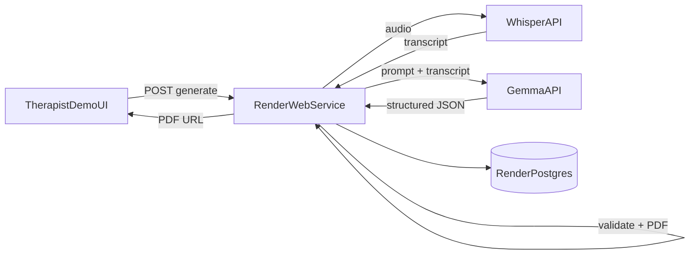

# Hacktoberfest Weekend 2026 — Submission Scope

> **Branch:** `hacktoberfest/render-session-note`  
> **Challenge:** Build for a Friend (DEV weekend challenge)  
> **Deadline:** 5 Oct 2026, 06:59 UTC (12:29 PM IST)  
> **Partner target:** Best Use of Render (+ optional Gemma / ElevenLabs only if spare time)  
>
> This doc is the **scope lock** for the weekend demo. It does **not** replace [`ARCHITECTURE_CLOUD.md`](./ARCHITECTURE_CLOUD.md). Cloud MVP work continues there after the contest.  
> Slice tracker for this branch: [`SLICES_PLAN_HACKTOBERFEST.md`](./SLICES_PLAN_HACKTOBERFEST.md).  
> Mobile dual-auth + motion UI on this branch (not contest scoring): [`UI_DUAL_AUTH_AND_MOTION.md`](./UI_DUAL_AUTH_AND_MOTION.md).

---

## 1. Who it is for (prompt: Build for a Friend)

A therapist friend who wants session notes without typing them up after a call.

**Weekend story:** given a short pre-recorded session audio, the system transcribes it, builds a structured clinical note (JSON), stores it in Postgres, and returns a PDF the therapist can download.

---

## 2. In scope (ship this)

| Item | Detail |
|---|---|
| Hosting | One **Render** web service + **Render Postgres** (Hobby / free) |
| Demo UX | Minimal web page (or thin therapist screen): pick fixture → “Generate note” → status → PDF download |
| Audio | **Pre-recorded fixture only** (2–3 min scripted fake session; no real PHI) |
| STT | **Open-weight Whisper** via hosted API (e.g. Groq `whisper-large-v3-turbo`) — called **from** the Render server |
| Note LLM | **Open-weight Gemma** via hosted API (e.g. Google AI Studio) — called **from** the Render server |
| Persist | Transcript text + structured note JSON + PDF path/key in **Render Postgres** |
| PDF | Generated **on the Render server** from validated JSON |
| Adapters | `SttProvider` / `LlmProvider` ports; env-selected; no provider keys in the client |
| Contest artifacts | Public Render URL, repo link, DEV write-up with demo |

## 3. Out of scope (explicitly not this weekend)

- Live WebRTC / SFU / server call recording  
- Real therapist↔patient auth, invites, mobile E2E product polish  
- On-device ExecuTorch / local Whisper+LLM path  
- LangChain, agent frameworks, Temporal, Mastra  
- Object storage vendor bake-off (fixture audio can live in repo or Render disk for demo)  
- India residency / DPDP / real PHI  
- Fine-tuning (Tinker), TabPFN, Arduino  
- Background Worker service on Render (use in-process pipeline on free web service)

---

## 4. Approach diagram

```
┌─────────────────────────────────────────────────────────────────┐
│                     Therapist demo (browser)                    │
│         “Use sample session” → Generating… → Download PDF       │
└───────────────────────────────┬─────────────────────────────────┘
                                │ HTTPS
                                ▼
┌─────────────────────────────────────────────────────────────────┐
│              Render free web service (TypeScript)               │
│  API + in-process pipeline (no separate Background Worker)      │
│                                                                 │
│  1. Load fixture audio                                          │
│  2. SttProvider  ──────────────►  Whisper API (open weights)    │
│  3. LlmProvider  ──────────────►  Gemma API  (open weights)     │
│  4. validateStructuredNote(JSON)                                │
│  5. buildPdf(note) → save file / key                            │
│  6. INSERT session row (transcript, note JSON, pdf_key, status) │
└─────────────────┬───────────────────────────────┬───────────────┘
                  │                               │
                  ▼                               ▼
     ┌────────────────────┐            ┌────────────────────┐
     │ Render Postgres    │            │ PDF artifact       │
     │ (metadata + text)  │            │ (on service or     │
     │                    │            │  simple file path) │
     └────────────────────┘            └────────────────────┘
```



**Rule:** Render hosts the **app + DB + PDF**. Whisper and Gemma run on **provider APIs** (open weights). Nothing loads model weights into the 512 MB free instance.

---

## 5. Open-weight choices (locked for this submission)

| Step | Model | Runs where | Notes |
|---|---|---|---|
| STT | Whisper (`whisper-large-v3-turbo` preferred) | Hosted API (Groq) | Open weights; free tier enough for short fixture |
| Structured note | Gemma instruct (small / free-tier) | Hosted API (Google AI Studio) | Open weights; JSON schema + validate before save |
| PDF | Deterministic code | On Render | Not an AI model |

Secrets stay in Render env vars only (`GROQ_API_KEY`, `GEMMA_API_KEY` / Google key, `DATABASE_URL`).

---

## 6. Definition of done (submission gate)

1. Deployed Render URL works without local setup for a judge.  
2. One click (or one API call) on the fixture yields PDF + Postgres row.  
3. Write-up names the **friend**, why open Whisper + Gemma matter, and how Render is used.  
4. No real patient audio; fixture labeled as synthetic.  
5. All `H*` slices in [`SLICES_PLAN_HACKTOBERFEST.md`](./SLICES_PLAN_HACKTOBERFEST.md) marked `DONE` or consciously `PARKED` with reason.

---

## 7. What you (human) must do before / while agents build

Agents cannot create your accounts or paste secrets into Render for you. Do these **in order**. Checkboxes are for you.

### A. Accounts & API keys

1. [ ] Sign in at [hacktoberfest.com/my/promos](https://hacktoberfest.com/my/promos) and claim **Render** (and optional ElevenLabs) credits if shown.  
2. [ ] Create a [Render](https://render.com) account (Hobby / free). Prefer claiming the contest promo first.  
3. [ ] Create a [Groq](https://console.groq.com) account → API key with access to Whisper STT.  
4. [ ] Create a [Google AI Studio](https://aistudio.google.com) API key with access to a **Gemma** model (or the contest-documented Gemma path).  
5. [ ] (Optional) DEV + MyMLH linked for submission; Copilot not required for the demo.

### B. Local secrets for development

6. [ ] Copy `.env.example` (added on this branch when H0 lands) to `.env` / `.env.local` — **never commit real keys**.  
7. [ ] Fill at least:
   - `GROQ_API_KEY=…`
   - `GOOGLE_AI_API_KEY=…` (or whatever name the adapter uses)
   - `DATABASE_URL=…` (local Postgres **or** Render external URL later)

### C. Render project wiring

8. [ ] In Render Dashboard: create a **PostgreSQL** instance (free). Copy **Internal** `DATABASE_URL` for the web service; use **External** only for local laptop access.  
9. [ ] Create a **Web Service** from this GitHub repo + branch `hacktoberfest/render-session-note`.  
10. [ ] Set env vars on the web service: `DATABASE_URL`, `GROQ_API_KEY`, `GOOGLE_AI_API_KEY`, `NODE_ENV=production`, any `PUBLIC_BASE_URL`.  
11. [ ] Confirm free instance type; accept spin-down (cold start ~1 min). Do **not** add a Background Worker (paid).  
12. [ ] After first deploy: hit health check URL; run one generate; confirm a row in Postgres (Render shell / external SQL client).

### D. Fixture & compliance

13. [ ] Approve / record a **2–3 minute synthetic** session script (two speakers, no real names/PHI). Prefer checking in a short `.wav` / `.mp3` under an agreed fixtures path.  
14. [ ] Confirm write-up language: demo data only; not for real clinical use.

### E. Submission package

15. [ ] Record a 30–60s screen capture of the happy path.  
16. [ ] Publish DEV post with template tags; link Render URL + repo + this scope doc.  
17. [ ] Enter partner category **Best Use of Render** (and Gemma only if Gemma is clearly in the demo path).

### F. Hand-off to the agent (each coding session)

When you want the agent to implement the next slice, paste:

- Current sub-slice ID from [`SLICES_PLAN_HACKTOBERFEST.md`](./SLICES_PLAN_HACKTOBERFEST.md) (e.g. `H2.1`)  
- Whether keys are already in local `.env` and/or Render  
- Render service URL once it exists  

Do **not** paste raw API keys into chat if you can avoid it; say “keys are in `.env` / Render dashboard”.

---

## 8. Relation to cloud MVP

| This weekend | Later (ARCHITECTURE_CLOUD) |
|---|---|
| Fixture audio | Live server record + completeness gate |
| In-process pipeline on free web service | Job queue + worker |
| Web demo UI | RN therapist + patient apps |
| Whisper + Gemma adapters | Same ports; swap providers / region via env |

Patterns we keep: provider ports, structured-note validation, no PHI in logs, no LangChain, Postgres for metadata + text.
