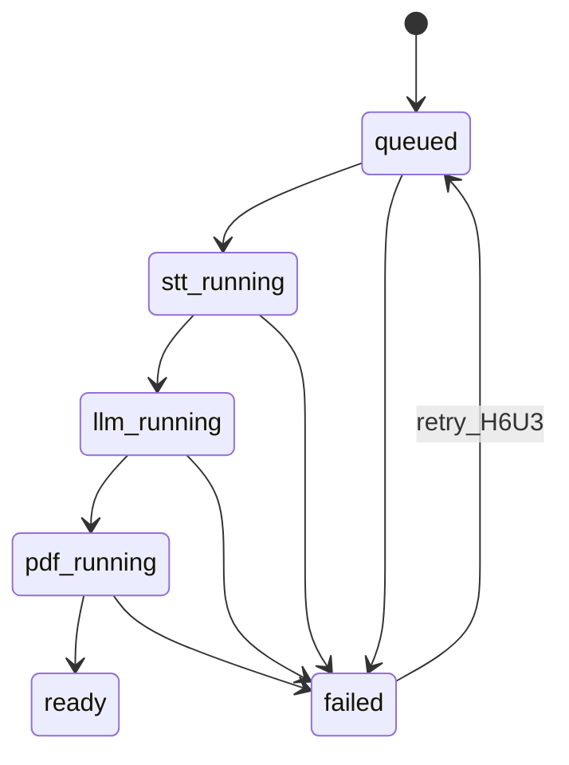
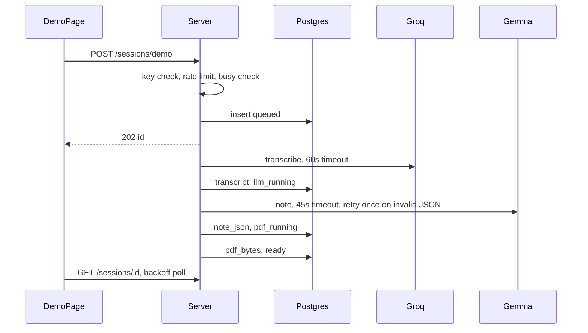
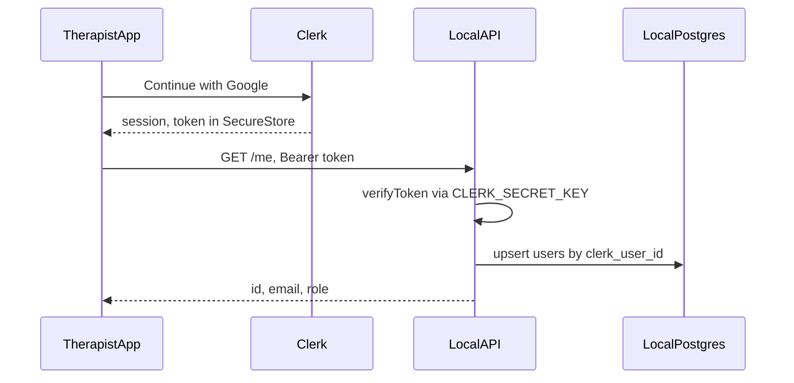
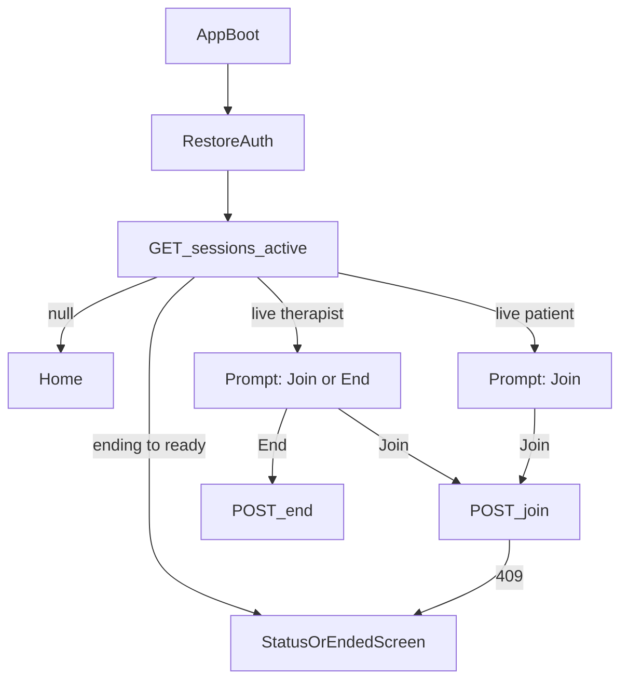

# LLD — Hacktoberfest Branch

> **Branch:** `hacktoberfest/render-session-note` only. Does not change cloud MVP docs.
> **HLD sources:** [`HACKTOBERFEST_WEEKEND_SCOPE.md`](./HACKTOBERFEST_WEEKEND_SCOPE.md) (Part 1) · live-session HLD agreed in planning (Part 2).
> **Tracker:** [`SLICES_PLAN_HACKTOBERFEST.md`](./SLICES_PLAN_HACKTOBERFEST.md) — each section names the slice it feeds.
>
> - **Part 1** — Render demo: built (H0–H5) + planned (H5S–H9).
> - **Part 2** — Live session design (duration, rejoin, supersede, presence). Design only on this branch; no code until a slice is opened for it.

---

## Conventions (both parts)

| Rule | Detail |
|---|---|
| Errors | Snake-case codes (`stt_timeout`), max 160 chars, never provider bodies or PHI |
| Layers (API) | `create-server` (HTTP) → `pipeline/*` → `db/*` + `providers/*` |
| Layers (mobile) | `app/` → `stores/` → `services/` (no fetch from screens) |
| Logs | Event names only (`demo_pipeline_failed`). No transcript, note, path, IP |
| Status changes | Only via `assertTransition`; SQL guarded on current status |
| Time | Server clock is truth; responses carry `serverNow` where timers matter |

---

# Part 1 — Render demo

## 1.1 Module map

| File | Responsibility | Slice |
|---|---|---|
| `src/index.ts` | Wire config, pool, providers, server; start listen | H0 |
| `src/create-server.ts` | Routing, JSON/PDF responses | H0–H5 |
| `src/config.ts` | Env → `AppConfig` | H0 |
| `src/db/session-repository.ts` | CRUD + guarded status update | H1 |
| `src/domain/session-status.ts` | Transition table | H1 |
| `src/providers/groq-whisper-stt.ts` | `SttProvider` | H2 |
| `src/providers/gemma-llm.ts` | `LlmProvider` | H3 |
| `src/domain/structured-note.ts` | Extract + validate SOAP JSON | H3 |
| `src/pipeline/run-*-step.ts` | One step each; persist result or `failed` | H2–H4 |
| `src/pdf/*` | Build PDF bytes; serve | H4 |
| `src/http/session-view.ts` | Public DTO (no transcript/note) | H5 |
| **new** `src/http/rate-limit.ts` | Per-IP + global caps | H5S.1 |
| **new** `src/http/security-headers.ts` | Header set applied in `sendJson` / `sendPdf` / HTML | H5S.5 |
| **new** `src/http/client-ip.ts` | First `x-forwarded-for` hop → salted SHA-256 | H5S.1 |
| **new** `src/pipeline/recover-interrupted.ts` | Boot sweep of stuck sessions | H5S.3 |
| **new** `src/shutdown.ts` | `SIGTERM` handler | H5S.6 |

## 1.2 Data model

Current: `migrations/001_demo_sessions.sql`.

Migration order: `002_users.sql` (H5A, §1.12) → `003_hardening.sql` (below) → `004_live_sessions.sql` (Part 2, when opened).

**`003_hardening.sql`** (H5S.1, H5S.4, H6U.3):

```sql
ALTER TABLE demo_sessions
  ADD COLUMN pdf_bytes BYTEA,
  ADD COLUMN client_ip_hash TEXT,
  ADD COLUMN attempt INT NOT NULL DEFAULT 1;

CREATE INDEX demo_sessions_ip_created_idx
  ON demo_sessions (client_ip_hash, created_at DESC);
```

- `pdf_path` kept for back-compat, no longer written after H5S.4.
- Rate limits count rows — no separate table, survives restarts.
- `client_ip_hash = sha256(IP_HASH_SALT + ip)`; raw IP never stored.

## 1.3 State machine



| Change | Detail |
|---|---|
| New transition | `failed → queued` (retry). Increments `attempt`; max 3 |
| Guarded UPDATE | `UPDATE … WHERE id = $1 AND status = $expected` → 0 rows = `status_conflict` (fixes read-then-write race) |
| Clear error on retry | Retry sets `error = NULL` explicitly (current `COALESCE` cannot clear) |
| Resume point | Retry restarts from the first missing artifact: no transcript → STT; no note → LLM; else PDF |

## 1.4 API contract

| Method + path | Request | Success | Errors | Slice |
|---|---|---|---|---|
| `GET /health` | — | `200 {ok:true}` | — | H0 |
| `GET /` | — | HTML | — | H5 |
| `POST /sessions/demo` | `x-demo-key` if `DEMO_ACCESS_KEY` set | `202 {id,status}` | `401 demo_key_required`, `429 rate_limited`, `503 busy` / `demo_unavailable` | H5, H5S.1, H6.9 |
| `GET /sessions/:id` | — | `200 PublicSession` | `404 session_not_found` | H5 |
| `GET /sessions/:id/pdf` | — | `200 application/pdf` | `404 pdf_not_ready` | H4, H5S.4 |
| `POST /sessions/:id/retry` | same key rule | `202 {id,status}` | `409 not_failed`, `409 max_attempts`, `429` | H6U.3 |
| `GET /sessions/:id/note` | — | `200 StructuredNote` (synthetic only) | `404 note_not_ready` | H6U.5 |
| `GET /sessions?limit=5` | — | `200 PublicSession[]` | — | H9.2 |
| `POST /sessions/upload` | `audio/wav` or `audio/mpeg`, ≤ 5 MB, ≤ 5 min | `202 {id,status}` | `413 too_large`, `415 bad_type`, `422 too_long` | H9.1 |

`PublicSession` adds `attempt` (H6U.3). Never adds transcript.

## 1.5 Pipeline + limits



| Limit | Value | Code |
|---|---|---|
| Per-IP starts | 3 / rolling hour | `rate_limited` |
| Global starts | 50 / rolling day | `rate_limited` |
| Concurrent pipelines (in-process) | 2 | `busy` |
| STT timeout | 60s | `stt_timeout` |
| LLM timeout | 45s per attempt | `llm_timeout` |
| Retry attempts | 3 total | `max_attempts` |

Timeouts via `AbortSignal.timeout(ms)` passed into `fetchImpl`; `AbortError` mapped to the code.

## 1.6 Edge cases

| Case | Handling |
|---|---|
| Render restarts mid-pipeline | Boot: `queued` / `*_running` → `failed` `interrupted_restart`; user can retry |
| Render disk wiped | PDF served from `pdf_bytes`; `pdf_path` ignored |
| Double-click generate | Button disabled while running; server limits still apply |
| Provider 429 / 5xx | `stt_http_429` / `llm_http_503` → `failed`; retry allowed |
| LLM invalid JSON twice | `failed` with validator code (existing) |
| DB missing at boot | Server starts; session routes `503` (existing); `/health` stays ok |
| Two transitions race | Guarded UPDATE → `status_conflict`; loser stops |
| Cold start (~1 min) | Page shows waking notice after 3s without response |
| Unknown session id | `404`; UUID regex rejects non-UUIDs |
| Shutdown during run | `SIGTERM` stops accepting; running sessions recovered on next boot |

## 1.7 Security

| Item | Value |
|---|---|
| CSP | `default-src 'self'; script-src 'self' 'unsafe-inline'; style-src 'self' 'unsafe-inline'; frame-ancestors 'none'` (inline kept: single static page) |
| Other headers | `X-Content-Type-Options: nosniff`, `X-Frame-Options: DENY`, `Referrer-Policy: no-referrer` |
| Access key | `DEMO_ACCESS_KEY` set → required on start/retry/upload; compare with `timingSafeEqual` |
| Session URLs | UUID = capability URL; acceptable for synthetic data only (H6.10) |
| Secrets | `GROQ_API_KEY`, `GOOGLE_AI_API_KEY`, `DATABASE_URL`, `IP_HASH_SALT`, `DEMO_ACCESS_KEY` — Render env only |

## 1.8 Demo page behaviour (H6U)

| UI state | Trigger | Shows |
|---|---|---|
| `idle` | load | "Use sample session" |
| `waking` | start pending > 3s | "Waking server (~1 min)" |
| `running` | 202 | Steps: Transcribing → Writing note → Building PDF |
| `ready` | status ready | Note preview + Download PDF |
| `failed` | status failed | Plain-language error + Retry (if `attempt < 3`) |
| `limited` | 429 | "Demo limit reached, try later" |

Polling: 1s × 5, then 2s × 10, then 5s; give up after 3 min; pause on `visibilitychange` hidden. Spinner/transitions off under `prefers-reduced-motion`.

## 1.9 Mobile (H8)

| Item | Design |
|---|---|
| H8.1 Auth storage | `appStorage` MMKV gets `encryptionKey` from `expo-secure-store` (generated once). Token becomes `demo-therapist-<random>`; email not stored |
| H8.2 Logs | `babel.config.js` with `transform-remove-console` in production; AI hooks log codes only |
| H8.3 POC routes | `poc.tsx` / `explore.tsx` redirect to `/` when `!__DEV__` |
| H8.4 Lazy native | ExecuTorch / ffmpeg / Whisper imported via dynamic `import()` behind `LOCAL_ON_DEVICE_AI_ENABLED` |
| H8.5 Motion | Every animated component reads `useMotionBudget()`; `none` → static |
| H8.6 Audio lib | Remove `expo-av`; migrate any use to `expo-audio` |
| H8.7 Demo screen | `app/(app)/demo-note.tsx` → `stores/demo-note-store.ts` → `services/demo-api/demo-api-client.ts` (base URL `EXPO_PUBLIC_DEMO_API_URL`, non-secret) |

`demo-api-client` returns `Result<T>`; same poll schedule as 1.8; PDF opened via `expo-sharing`.

## 1.10 DX (H6)

| Item | Design |
|---|---|
| `render.yaml` | 1 web service (`yarn workspace hacktoberfest-api start`), 1 Postgres; `preDeployCommand: yarn workspace hacktoberfest-api migrate` |
| Root scripts | `hacktoberfest:typecheck`, `hacktoberfest:migrate`, `hacktoberfest:check` |
| `.nvmrc` | `20` |
| Test glob | `node --import tsx --test 'src/__tests__/*.test.ts'` (quoted, no shell globstar) |
| Local DB | `docker-compose.yml`: `postgres:16`, port 5432, matches `.env.example` |
| CI | `.github/workflows/hacktoberfest.yml`: on PR to branch → install, API typecheck + test (Postgres service), mobile test + typecheck. `LIVE_PROVIDER_SMOKE=0` |

## 1.11 Test map

| Slice | New tests |
|---|---|
| H5S.1 | `rate-limit.test.ts`, `client-ip.test.ts` |
| H5S.2 | `groq-whisper-stt.test.ts`, `gemma-llm.test.ts` (timeout cases) |
| H5S.3 | `recover-interrupted.test.ts` |
| H5S.4 | `run-pdf-step.test.ts`, `session-pdf-route.test.ts` (bytes from DB) |
| H5S.5 | `security-headers.test.ts` |
| H5S.6 | `shutdown.test.ts` |
| H6U.3 | `session-status.test.ts` (`failed → queued`), `retry-route.test.ts` |
| H8.7 | `demo-api-client.test.ts`, `demo-note-store.test.ts` |
| H5A | `clerk-auth.test.ts`, `user-repository.test.ts`, `me-route.test.ts`, mobile `auth-store.test.ts` |

## 1.12 Therapist auth — Clerk + Google (H5A)



**`002_users.sql`:**

```sql
CREATE TABLE users (
  id UUID PRIMARY KEY DEFAULT gen_random_uuid(),
  clerk_user_id TEXT NOT NULL UNIQUE,
  email TEXT,
  role TEXT NOT NULL DEFAULT 'therapist' CHECK (role IN ('therapist', 'patient')),
  created_at TIMESTAMPTZ NOT NULL DEFAULT now(),
  last_seen_at TIMESTAMPTZ NOT NULL DEFAULT now()
);
```

| Item | Design |
|---|---|
| Server files | `src/auth/verify-clerk-token.ts` (wraps `@clerk/backend` `verifyToken`, injectable for tests), `src/db/user-repository.ts`, route `GET /me` |
| Upsert | `INSERT … ON CONFLICT (clerk_user_id) DO UPDATE SET last_seen_at = now()`; no Clerk webhook yet |
| Default role | `therapist` for every Google login; patients never use Google in this slice |
| Role source | DB only; mobile never sends a role |
| Errors | `401 auth_missing`, `401 auth_invalid`; never echo token or Clerk error body |
| Mobile files | `ClerkProvider` in `app/_layout.tsx`; `services/auth/clerk-token-cache.ts` (SecureStore); `services/api/api-client.ts` (Bearer + `Result<T>`); `stores/auth-store.ts` maps `/me` → `AuthSession` |
| Mobile deps | `@clerk/clerk-expo` (+ `expo-auth-session` if required by its Google SSO hook); `expo-secure-store` and `expo-web-browser` already installed |
| Demo login | Visible only in `__DEV__` |
| Runs in | Dev client (`expo run:ios` / `run:android`), not Expo Go |

**Env (local):**

| File | Key | Secret? |
|---|---|---|
| `apps/CaseScriptAI/.env` | `EXPO_PUBLIC_CLERK_PUBLISHABLE_KEY`, `EXPO_PUBLIC_DEMO_API_URL` | No |
| `apps/hacktoberfest-api/.env` | `CLERK_SECRET_KEY`, `DATABASE_URL` (local docker) | Yes — never commit or paste |

**Local networking:** iOS simulator → `http://localhost:3001`; Android emulator → `http://10.0.2.2:3001`; physical device → laptop LAN IP.

**Edge cases:**

| Case | Handling |
|---|---|
| Token expired mid-session | `api-client` calls `getToken()` per request (Clerk refreshes); on 401 once more → sign out |
| API down after Google sign-in | Stay on login with "Can't reach server"; Clerk session kept, retry `/me` |
| User cancels Google sheet | No state change, no error toast |
| Same Google account on 2 devices | Same `users` row; both sessions valid (Part 2 device rule applies only in live calls) |
| Clerk user deleted | Next `/me` → 401 → sign out; row stays (cleanup later via webhook) |

---

# Part 2 — Live session design

> Feeds future live-session slices. Vendor-neutral: SFU/recording choice still open.

## 2.1 Entities

Ships as `004_live_sessions.sql`; `therapist_id` / `patient_id` reference `users(id)` from §1.12.

```sql
sessions (
  id UUID PK,
  therapist_id UUID NOT NULL,
  patient_id UUID,
  status TEXT NOT NULL,             -- scheduled | live | ending | … | ready | failed
  planned_duration_min INT NOT NULL CHECK (planned_duration_min BETWEEN 10 AND 90),
  live_started_at TIMESTAMPTZ,
  ends_at TIMESTAMPTZ,
  end_reason TEXT,                  -- therapist_end | time_expired | superseded | therapist_end_offline
  room_id TEXT,
  canonical_audio_key TEXT,
  created_at, updated_at
);
CREATE UNIQUE INDEX one_live_per_therapist ON sessions (therapist_id) WHERE status = 'live';

session_presence (
  session_id UUID, role TEXT,       -- therapist | patient
  state TEXT,                       -- connected | reconnecting | disconnected
  last_seen_at TIMESTAMPTZ,
  device_id TEXT,
  PRIMARY KEY (session_id, role)
);

session_events (                    -- audit, non-PHI
  id BIGSERIAL, session_id UUID, type TEXT, actor TEXT, at TIMESTAMPTZ, data JSONB
);
```

## 2.2 Session transitions

| From | To | Actor | Guard |
|---|---|---|---|
| `scheduled` | `live` | therapist join | supersede runs first (2.5) |
| `live` | `live` | therapist PATCH duration | rules in 2.3 |
| `live` | `ending` | therapist END | — |
| `live` | `ending` | scheduler | `now ≥ ends_at` → `time_expired` |
| `live` | `ending` | supersede | new session for same therapist → `superseded` |
| `ending` | `recording_finalizing` → … → `ready` | pipeline | completeness gate |

END is idempotent: second END on `ending`+ returns `200` with current status.

## 2.3 Duration rules

| Rule | Formula |
|---|---|
| Set at create | `planned_duration_min ∈ [10, 90]` |
| Start | `ends_at = live_started_at + planned_duration_min` |
| Extend / shorten | `new_ends_at ∈ [now + 5 min, live_started_at + 90 min]` else `422 duration_out_of_range` |
| Not live | `409 session_not_live` |
| Warnings | Client shows at `ends_at − 5 min` and `− 1 min` from server `ends_at` |
| Expiry | Sweep every 15s: `live AND ends_at ≤ now()` → END `time_expired` |

## 2.4 Presence

| Signal | Effect |
|---|---|
| SFU participant joined | `connected`, `last_seen_at = now` |
| SFU participant left / ICE failed | `reconnecting` |
| No rejoin in 60s | `disconnected` (peer UI updates) |
| Client heartbeat every 10s | Fallback when SFU events lag; 3 misses = `reconnecting` |
| Second device for same role | Latest join wins; older device token revoked, gets `device_replaced` |

Presence never ends a session. Only END, expiry, or supersede do.

## 2.5 Supersede (one live per therapist)

In one transaction:

1. `SELECT … FROM sessions WHERE therapist_id = $t AND status = 'live' FOR UPDATE`
2. For each: set `ending`, `end_reason = 'superseded'`, enqueue finalize
3. Set the new session `live`, compute `ends_at`
4. Commit → realtime: close old room (patient gets `SESSION_SUPERSEDED`)

The partial unique index rejects any race that skips step 1.

## 2.6 API

| Method + path | Who | Returns |
|---|---|---|
| `POST /sessions` | therapist | `{id, plannedDurationMin}` |
| `GET /sessions/active` | both | `{session, role, serverNow, endsAt} \| null` |
| `POST /sessions/:id/join` | both | realtime token; therapist join may supersede |
| `PATCH /sessions/:id/duration` | therapist | `{endsAt, serverNow}` |
| `POST /sessions/:id/end` | therapist | `{status}` |
| `POST /sessions/:id/heartbeat` | both | `{serverNow, endsAt, peerState}` |

Clients poll `heartbeat` every 10s in call; its response carries duration changes, so no extra push channel is needed.

## 2.7 Cold-start client flow



## 2.8 Therapist local backup

| Item | Design |
|---|---|
| Format | 30s WAV chunks under `backup/<sessionId>/<seq>.wav` + `manifest.json` (`seq`, bytes, startedAt) |
| Write | Flush each chunk to disk on close; manifest updated after each chunk |
| After kill | On rejoin, read manifest, continue at `max(seq) + 1` |
| Upload | Only when the completeness gate asks; multipart, resumable by chunk |
| Purge | On `ready`, or when the gate picks the server artifact |
| Storage low | Stop backup, set `backup_degraded` event; call continues |

## 2.9 Error codes

| Code | HTTP | When |
|---|---|---|
| `session_not_live` | 409 | PATCH / join on non-live |
| `rejoin_rejected` | 409 | Join after END / expiry / supersede |
| `duration_out_of_range` | 422 | Duration rules fail |
| `not_session_therapist` | 403 | Patient or other therapist tries END / PATCH |
| `device_replaced` | 409 | Newer device joined same role |
| `session_superseded` | — | Realtime event to old room |
| `time_expired` | — | `end_reason` |
| `recording_degraded` / `recording_missing` | — | Gate outcomes |

## 2.10 Edge cases

| Case | Handling |
|---|---|
| END and expiry at the same instant | Guarded UPDATE; second is no-op |
| PATCH arrives after `ending` | `409 session_not_live` |
| Patient joins after supersede | `409 rejoin_rejected` → "Session ended" |
| Client clock wrong | Countdown from `endsAt − serverNow` offset, never device time |
| Both offline until `ends_at` | Expiry ENDs; gate uses whatever audio exists |
| Therapist taps End on cold-start prompt with no media | Allowed; same END path |
| Network drops during PATCH | Client retries with same target `endsAt` (idempotent) |

## 2.11 Tests to write first

1. Transition table incl. idempotent END and supersede.
2. Duration bounds: min 5 min remaining, 90 max, not-live reject.
3. Expiry sweep picks only `live AND ends_at ≤ now`.
4. Supersede transaction + unique index race.
5. Presence timers: 60s grace, heartbeat misses, device replace.
6. Backup manifest resume after simulated kill.
